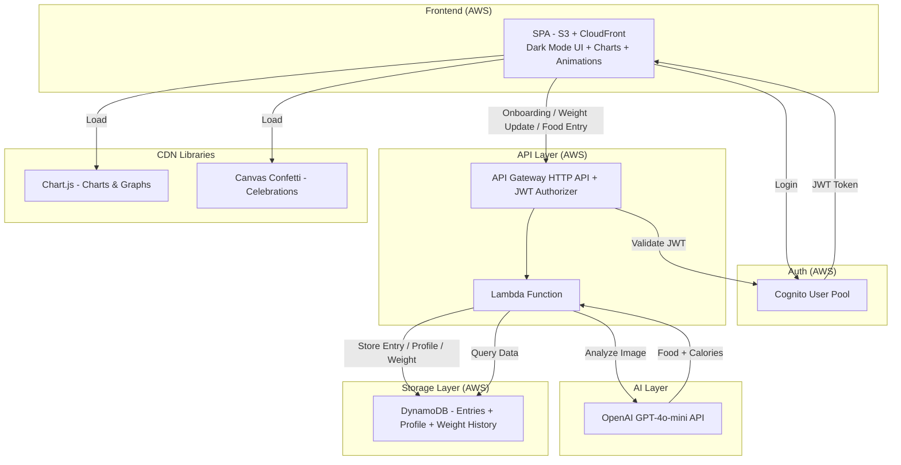
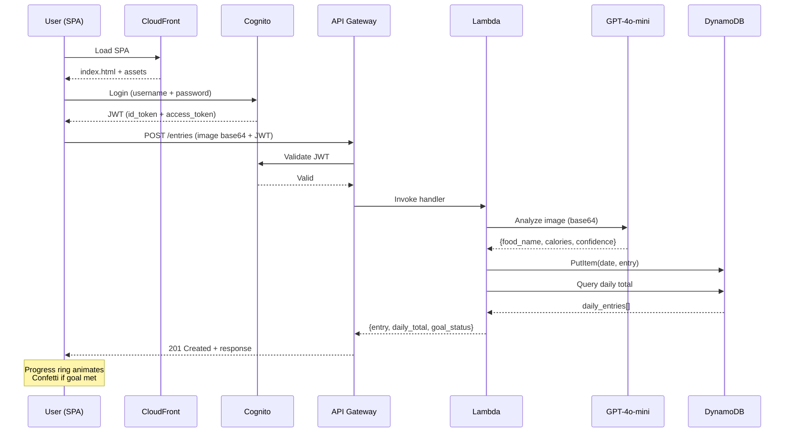
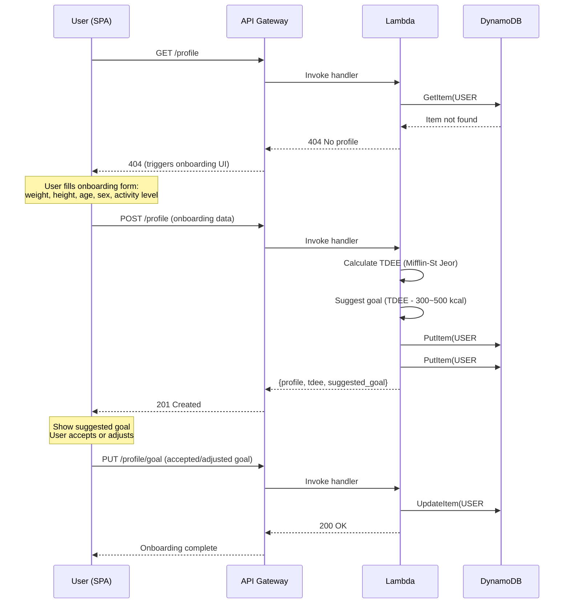
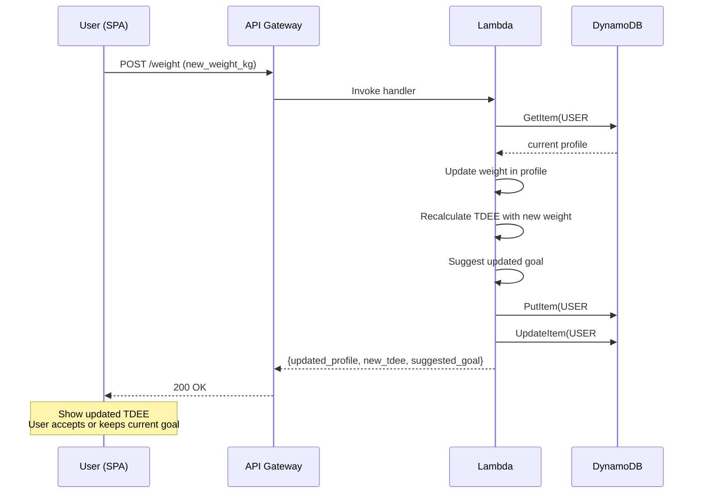
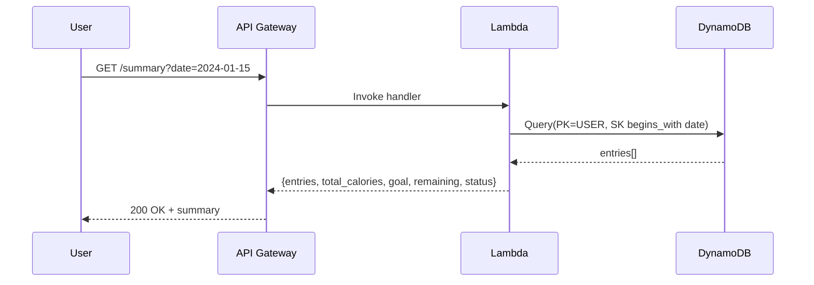

# Design Document: AI Calorie Tracker

## Overview

Personal AI-powered calorie tracking application that allows a single user to photograph food items, identify them using the cheapest available AI model, estimate their caloric content, and accumulate daily intake against a personalized caloric goal based on TDEE (Total Daily Energy Expenditure). The system features a guided onboarding flow that calculates the user's TDEE using the Mifflin-St Jeor formula, suggests a calorie deficit goal, and tracks weight progress over time.

The application features a premium dark-mode UI with animated progress rings, weekly bar charts, weight tracking line charts, and celebration animations — all built with vanilla JavaScript, CSS animations, and Chart.js for zero build cost. The design targets a modern, professional fitness app aesthetic.

The application follows Clean Architecture principles with a clear separation between domain logic, application use cases, and infrastructure concerns. It deploys on AWS using Terraform with extreme cost optimization as the primary constraint — leveraging serverless, pay-per-use services exclusively.

The development approach is TDD-first: all domain logic and use cases are covered by unit tests before implementation, with integration tests validating AWS service interactions.

## Architecture



### Cost Optimization Strategy

| Service | Why Chosen | Cost Model |
|---------|-----------|------------|
| API Gateway HTTP API | Cheaper than REST API ($1/million requests) | Pay per request |
| Lambda (ARM64, 128MB) | No idle cost, ARM is 20% cheaper | Pay per invocation + duration |
| DynamoDB On-Demand | No provisioned capacity needed for single user | Pay per read/write |
| S3 Standard (frontend) | Static hosting, no server cost | ~$0.023/GB/month |
| CloudFront | CDN for frontend, free tier 1TB/month | Pay per request (mostly free) |
| Cognito User Pool | Free tier: 50,000 MAU | $0 for single user |
| GPT-4o-mini | Cheapest multimodal model (~$0.15/1M input tokens) | Pay per token |

**Estimated monthly cost for single user (10 meals/day):** < $1 USD

## Sequence Diagrams

### Main Flow: Upload Food Photo



### Flow: Onboarding (First-Time Setup)



### Flow: Weight Update



### Flow: Get Daily Summary



## Components and Interfaces

### Component 1: Domain Layer

**Purpose**: Contains business entities and rules, zero dependencies on external frameworks.

```python
from dataclasses import dataclass
from datetime import date
from enum import Enum
from typing import Optional


class GoalStatus(Enum):
    WITHIN_GOAL = "within_goal"
    EXCEEDED = "exceeded"


class Sex(Enum):
    MALE = "male"
    FEMALE = "female"


class ActivityLevel(Enum):
    SEDENTARY = "sedentary"          # Little or no exercise
    LIGHT = "light"                  # Light exercise 1-3 days/week
    MODERATE = "moderate"            # Moderate exercise 3-5 days/week
    ACTIVE = "active"                # Hard exercise 6-7 days/week
    VERY_ACTIVE = "very_active"      # Very hard exercise, physical job


ACTIVITY_MULTIPLIERS = {
    ActivityLevel.SEDENTARY: 1.2,
    ActivityLevel.LIGHT: 1.375,
    ActivityLevel.MODERATE: 1.55,
    ActivityLevel.ACTIVE: 1.725,
    ActivityLevel.VERY_ACTIVE: 1.9,
}


@dataclass(frozen=True)
class UserProfile:
    weight_kg: float
    height_cm: float
    age: int
    sex: Sex
    activity_level: ActivityLevel
    daily_calorie_goal: int
    tdee: int


@dataclass(frozen=True)
class WeightRecord:
    date: str          # ISO format YYYY-MM-DD
    weight_kg: float


@dataclass(frozen=True)
class FoodEntry:
    entry_id: str
    food_name: str
    calories: int
    confidence: float
    timestamp: str
    date: str


@dataclass(frozen=True)
class DailyGoal:
    target_calories: int

    def evaluate(self, total_calories: int) -> GoalStatus:
        if total_calories <= self.target_calories:
            return GoalStatus.WITHIN_GOAL
        return GoalStatus.EXCEEDED


@dataclass(frozen=True)
class DailySummary:
    date: str
    entries: list[FoodEntry]
    total_calories: int
    goal: DailyGoal
    status: GoalStatus
    remaining_calories: int


def calculate_bmr(weight_kg: float, height_cm: float, age: int, sex: Sex) -> float:
    """
    Mifflin-St Jeor BMR formula.
    
    Male:   BMR = (10 × weight_kg) + (6.25 × height_cm) - (5 × age) + 5
    Female: BMR = (10 × weight_kg) + (6.25 × height_cm) - (5 × age) - 161
    """
    base = (10 * weight_kg) + (6.25 * height_cm) - (5 * age)
    if sex == Sex.MALE:
        return base + 5
    return base - 161


def calculate_tdee(weight_kg: float, height_cm: float, age: int, sex: Sex, activity_level: ActivityLevel) -> int:
    """
    TDEE = BMR × Activity Multiplier
    Returns rounded integer.
    """
    bmr = calculate_bmr(weight_kg, height_cm, age, sex)
    multiplier = ACTIVITY_MULTIPLIERS[activity_level]
    return round(bmr * multiplier)


def suggest_calorie_goal(tdee: int, deficit: int = 400) -> int:
    """
    Suggest daily calorie goal with a deficit.
    Default deficit is 400 kcal (midpoint of 300-500 range).
    
    PRECONDITION: 300 <= deficit <= 500
    POSTCONDITION: result = tdee - deficit, result >= 1200 (safety floor)
    """
    goal = tdee - deficit
    return max(goal, 1200)  # Safety floor: never suggest below 1200 kcal
```

**Responsibilities**:
- Define immutable domain entities (FoodEntry, UserProfile, WeightRecord)
- Encapsulate business rules (goal evaluation, TDEE calculation)
- Mifflin-St Jeor formula implementation (pure, testable, no dependencies)
- No dependencies on infrastructure

### Component 2: Application Layer (Use Cases)

**Purpose**: Orchestrates domain logic, defines ports (interfaces) for external services.

```python
from abc import ABC, abstractmethod
from typing import Protocol


class ImageAnalyzer(Protocol):
    """Port: AI service for food recognition."""
    
    async def analyze_food_image(self, image_data: bytes) -> FoodAnalysisResult:
        ...


class EntryRepository(Protocol):
    """Port: Persistence for food entries."""
    
    async def save_entry(self, entry: FoodEntry) -> None:
        ...

    async def get_entries_by_date(self, date: str) -> list[FoodEntry]:
        ...


class UserProfileRepository(Protocol):
    """Port: Persistence for user profile and weight history."""
    
    async def get_profile(self) -> Optional[UserProfile]:
        ...

    async def save_profile(self, profile: UserProfile) -> None:
        ...

    async def save_weight_record(self, record: WeightRecord) -> None:
        ...

    async def get_weight_history(self, limit: int = 30) -> list[WeightRecord]:
        ...


@dataclass(frozen=True)
class FoodAnalysisResult:
    food_name: str
    estimated_calories: int
    confidence: float


@dataclass(frozen=True)
class OnboardingResult:
    profile: UserProfile
    tdee: int
    suggested_goal: int


@dataclass(frozen=True)
class WeightUpdateResult:
    updated_profile: UserProfile
    new_tdee: int
    suggested_goal: int
    weight_history: list[WeightRecord]
```

**Responsibilities**:
- Define use case orchestration
- Declare ports (Protocol classes) for dependency inversion
- Coordinate between domain entities and infrastructure
- Handle onboarding flow orchestration
- Handle weight update with TDEE recalculation

### Component 3: Infrastructure Layer

**Purpose**: Implements ports with concrete AWS services and external APIs.

```python
class OpenAIImageAnalyzer:
    """Adapter: GPT-4o-mini for food recognition."""
    
    def __init__(self, api_key: str, model: str = "gpt-4o-mini"):
        self.api_key = api_key
        self.model = model

    async def analyze_food_image(self, image_data: bytes) -> FoodAnalysisResult:
        ...


class DynamoDBEntryRepository:
    """Adapter: DynamoDB for entry persistence."""
    
    def __init__(self, table_name: str):
        self.table_name = table_name

    async def save_entry(self, entry: FoodEntry) -> None:
        ...

    async def get_entries_by_date(self, date: str) -> list[FoodEntry]:
        ...


class DynamoDBUserProfileRepository:
    """Adapter: DynamoDB for user profile and weight history."""
    
    def __init__(self, table_name: str):
        self.table_name = table_name

    async def get_profile(self) -> Optional[UserProfile]:
        """GetItem PK=USER#default, SK=PROFILE"""
        ...

    async def save_profile(self, profile: UserProfile) -> None:
        """PutItem PK=USER#default, SK=PROFILE"""
        ...

    async def save_weight_record(self, record: WeightRecord) -> None:
        """PutItem PK=USER#default, SK=WEIGHT#YYYY-MM-DD"""
        ...

    async def get_weight_history(self, limit: int = 30) -> list[WeightRecord]:
        """Query PK=USER#default, SK begins_with WEIGHT#, ScanIndexForward=False"""
        ...
```

**Responsibilities**:
- Implement ports defined in application layer
- Handle AWS SDK interactions (DynamoDB for entries, profiles, weight history)
- Manage OpenAI API communication

### Component 4: Frontend Layer (SPA)

**Purpose**: Static single-page application served via S3 + CloudFront. Premium dark-mode UI with camera access, image upload, animated charts, and daily calorie tracking.

**Technology**: Vanilla JavaScript (no build step), CSS animations, Chart.js (CDN), Canvas Confetti (CDN).

```typescript
// Frontend structure (conceptual)
interface FrontendApp {
    // Auth
    login(username: string, password: string): Promise<AuthTokens>;
    logout(): void;
    getAccessToken(): string | null;

    // Onboarding
    checkOnboardingStatus(): Promise<boolean>;
    submitOnboardingData(data: OnboardingData): Promise<OnboardingResult>;
    acceptGoal(goal: number): Promise<void>;

    // Core features
    capturePhoto(): Promise<Blob>;
    uploadFoodImage(imageBlob: Blob): Promise<AddEntryResponse>;
    getDailySummary(date: string): Promise<DailySummaryResponse>;

    // Weight tracking
    updateWeight(weight_kg: number): Promise<WeightUpdateResult>;
    getWeightHistory(): Promise<WeightRecord[]>;

    // Charts & Visualization
    renderProgressRing(consumed: number, goal: number): void;
    renderWeeklyBarChart(weekData: DailySummary[]): void;
    renderWeightLineChart(weightHistory: WeightRecord[]): void;

    // Animations
    triggerConfetti(): void;
    animateProgressRing(from: number, to: number): void;
    shakeGoalExceeded(): void;
    showLoadingSpinner(): void;
    hideLoadingSpinner(): void;

    // UI State
    refreshDailyProgress(): void;
    showGoalStatus(status: GoalStatus): void;
}

interface OnboardingData {
    weight_kg: number;
    height_cm: number;
    age: number;
    sex: "male" | "female";
    activity_level: "sedentary" | "light" | "moderate" | "active" | "very_active";
}

interface AuthTokens {
    idToken: string;
    accessToken: string;
    refreshToken: string;
}
```

**Dark Mode Design System**:

| Element | Color | Usage |
|---------|-------|-------|
| Background (primary) | `#1a1a2e` | Main page background |
| Background (secondary) | `#16213e` | Cards, panels |
| Background (tertiary) | `#0f3460` | Elevated elements, modals |
| Accent (success) | `#00d68f` | Within goal, progress ring fill |
| Accent (warning) | `#ff9f43` | Approaching limit (>80%) |
| Accent (danger) | `#ff6b6b` | Goal exceeded, shake animation |
| Text (primary) | `#e8e8e8` | Main text |
| Text (secondary) | `#a0a0b0` | Labels, secondary info |
| Text (accent) | `#ffffff` | Headers, important values |
| Border | `#2a2a4a` | Card borders, dividers |

**Charts (Chart.js via CDN)**:
- **Daily Progress Ring**: Circular doughnut chart showing calories consumed vs remaining, animated on entry add
- **Weekly Bar Chart**: 7-day view with bars for daily intake (green if within goal, red if exceeded) and a horizontal line for the goal
- **Weight Line Chart**: Time series of weight records with smooth bezier curves, gradient fill

**Animations (CSS + requestAnimationFrame)**:
- **Progress ring**: `requestAnimationFrame` counter animation from previous value to new value on food entry
- **Confetti**: Canvas Confetti CDN library triggers when daily total first reaches exactly at or below goal
- **Shake**: CSS `@keyframes shake` on the calorie display when goal exceeded
- **Slide transitions**: CSS `transform: translateX()` with `transition` for view switching
- **Fade-in cards**: CSS `@keyframes fadeInUp` for entry cards appearing
- **Loading spinner**: CSS `@keyframes pulse` rotating spinner during AI analysis

**Key UI Screens**:
1. **Login screen** — Dark form, simple username + password
2. **Onboarding screen** — Step-by-step form (weight, height, age, sex, activity) → TDEE result → goal confirmation
3. **Dashboard** — Progress ring (center), today's entries list, quick-add camera button
4. **Weekly view** — Bar chart of daily intake vs goal
5. **Weight tracker** — Line chart + weight update form
6. **Settings** — Update goal, update weight

**Responsibilities**:
- Handle user authentication flow with Cognito
- Guide first-time users through onboarding
- Capture/select images and send to API
- Display animated daily progress ring and weekly charts
- Trigger celebration animations when goals are met
- Display weight progress over time
- Store JWT tokens in memory (not localStorage for security)
- Auto-refresh token before expiry

### Component 5: Authentication Layer (Cognito)

**Purpose**: Secures the API with JWT-based authentication. Only a single pre-created user can access the system.

```python
# Cognito configuration (Terraform)
# - User Pool with self-registration DISABLED
# - Password policy: minimum 8 chars, no special requirements (personal use)
# - No MFA (single personal user, cost optimization)
# - App Client with USER_PASSWORD_AUTH flow (simple login)
# - User created via AWS CLI or Terraform provisioner

# API Gateway JWT Authorizer validates:
# - Token issued by the correct User Pool
# - Token not expired
# - Token audience matches App Client ID
```

**Cognito Setup Constraints**:
- `allow_admin_create_user_only = true` — No self-registration
- `admin_create_user_config.allow_admin_create_user_only = true`
- Single user created via Terraform `aws_cognito_user` resource or CLI post-deploy
- App Client with `ALLOW_USER_PASSWORD_AUTH` explicit auth flow
- No hosted UI needed (custom login form in SPA)

## Data Models

### DynamoDB Table Design

**Table**: `nutritrack-entries`

| Attribute | Type | Role | Example |
|-----------|------|------|---------|
| PK | String | Partition key | `USER#default` |
| SK | String | Sort key | See patterns below |
| food_name | String | Identified food name | `"Grilled chicken salad"` |
| calories | Number | Estimated calorie count | `450` |
| confidence | Number | AI confidence score (0-1) | `0.87` |
| timestamp | String | ISO 8601 timestamp | `"2024-01-15T12:30:00Z"` |
| created_at | String | ISO 8601 creation time | `"2024-01-15T12:30:05Z"` |
| weight_kg | Number | Weight in kilograms | `78.5` |
| height_cm | Number | Height in centimeters | `175` |
| age | Number | Age in years | `30` |
| sex | String | Male or female | `"male"` |
| activity_level | String | Activity level enum | `"moderate"` |
| daily_calorie_goal | Number | Current calorie goal | `1850` |
| tdee | Number | Calculated TDEE | `2250` |

**Record Types & Sort Key Patterns**:

| Record Type | SK Pattern | Example | Attributes |
|-------------|-----------|---------|------------|
| User Profile | `PROFILE` | `PROFILE` | weight_kg, height_cm, age, sex, activity_level, daily_calorie_goal, tdee |
| Weight Record | `WEIGHT#YYYY-MM-DD` | `WEIGHT#2024-01-15` | weight_kg, created_at |
| Food Entry | `DATE#YYYY-MM-DD#ENTRY#uuid` | `DATE#2024-01-15#ENTRY#abc123` | food_name, calories, confidence, timestamp |

**Access Patterns**:
- Get user profile: GetItem PK = `USER#default`, SK = `PROFILE`
- Get all entries for a date: Query PK = `USER#default`, SK begins_with `DATE#2024-01-15#ENTRY#`
- Get single entry: GetItem PK + full SK
- Get weight history: Query PK = `USER#default`, SK begins_with `WEIGHT#`, ScanIndexForward=False
- Get weight for a specific date: GetItem PK = `USER#default`, SK = `WEIGHT#2024-01-15`

### Configuration Model

```python
@dataclass(frozen=True)
class AppConfig:
    daily_calorie_goal: int = 2000
    openai_api_key: str = ""
    openai_model: str = "gpt-4o-mini"
    dynamodb_table: str = "nutritrack-entries"
    aws_region: str = "us-east-1"
    default_deficit: int = 400       # Default calorie deficit (300-500 range)
    safety_floor_calories: int = 1200  # Minimum suggested goal
```

**Validation Rules**:
- `daily_calorie_goal` must be positive integer between 500 and 10000
- `openai_api_key` must be non-empty
- `openai_model` must be a valid OpenAI model identifier
- `dynamodb_table` must be non-empty string
- `default_deficit` must be between 300 and 500
- `safety_floor_calories` must be between 1000 and 1500

### API Endpoints

| Method | Path | Description |
|--------|------|-------------|
| POST | `/entries` | Upload food image, get AI analysis + calorie entry |
| GET | `/summary?date=YYYY-MM-DD` | Get daily summary with entries and goal status |
| GET | `/profile` | Get user profile (404 if not onboarded) |
| POST | `/profile` | Create profile during onboarding |
| PUT | `/profile/goal` | Update daily calorie goal |
| POST | `/weight` | Record new weight, recalculate TDEE |
| GET | `/weight/history?limit=30` | Get weight history for charts |
| GET | `/summary/week?start=YYYY-MM-DD` | Get 7-day summary for weekly chart |

## Key Functions with Formal Specifications

### Function 1: `add_food_entry()`

```python
async def add_food_entry(
    image_data: bytes,
    image_analyzer: ImageAnalyzer,
    entry_repository: EntryRepository,
    daily_goal: DailyGoal,
) -> AddEntryResult:
    ...
```

**Preconditions:**
- `image_data` is non-empty bytes representing a valid image (JPEG/PNG)
- `len(image_data) <= 20 * 1024 * 1024` (max 20MB)
- All service dependencies are properly initialized
- `daily_goal.target_calories > 0`

**Postconditions:**
- Returns `AddEntryResult` containing the new entry and updated daily summary
- Entry is persisted in repository with unique ID
- `result.daily_summary.total_calories` includes the new entry's calories
- `result.daily_summary.status` reflects goal evaluation after adding entry
- No mutation of input parameters

**Loop Invariants:** N/A (no loops in this function)

### Function 2: `get_daily_summary()`

```python
async def get_daily_summary(
    target_date: str,
    entry_repository: EntryRepository,
    daily_goal: DailyGoal,
) -> DailySummary:
    ...
```

**Preconditions:**
- `target_date` is a valid ISO date string (YYYY-MM-DD)
- `entry_repository` is properly initialized
- `daily_goal.target_calories > 0`

**Postconditions:**
- Returns `DailySummary` for the specified date
- `summary.total_calories == sum(entry.calories for entry in summary.entries)`
- `summary.remaining_calories == max(0, goal.target_calories - total_calories)`
- `summary.status == GoalStatus.WITHIN_GOAL` if and only if `total_calories <= goal.target_calories`
- Returns empty entries list with 0 total if no entries exist for date

**Loop Invariants:**
- Running total accumulator equals sum of all processed entries' calories

### Function 3: `analyze_food_image()` (AI Adapter)

```python
async def analyze_food_image(self, image_data: bytes) -> FoodAnalysisResult:
    ...
```

**Preconditions:**
- `image_data` is non-empty and represents a valid image
- OpenAI API key is valid and has sufficient credits
- Network connectivity is available

**Postconditions:**
- Returns `FoodAnalysisResult` with `food_name`, `estimated_calories`, `confidence`
- `estimated_calories >= 0`
- `0.0 <= confidence <= 1.0`
- `food_name` is a non-empty string
- If image does not contain recognizable food, raises `FoodNotRecognizedError`

**Loop Invariants:** N/A

### Function 4: `calculate_tdee()` (Domain - Pure)

```python
def calculate_tdee(
    weight_kg: float,
    height_cm: float,
    age: int,
    sex: Sex,
    activity_level: ActivityLevel,
) -> int:
    ...
```

**Preconditions:**
- `weight_kg > 0` and reasonable range (30.0 <= weight_kg <= 300.0)
- `height_cm > 0` and reasonable range (100.0 <= height_cm <= 250.0)
- `age > 0` and reasonable range (13 <= age <= 120)
- `sex` is a valid Sex enum value (MALE or FEMALE)
- `activity_level` is a valid ActivityLevel enum value

**Postconditions:**
- Returns positive integer representing total daily energy expenditure in kcal
- `result > 0`
- For same inputs, always returns same output (pure function)
- Male TDEE > Female TDEE (all other inputs equal) — due to +5 vs -161 constant
- Higher activity level → higher TDEE (all other inputs equal)
- Higher weight → higher TDEE (all other inputs equal)
- Higher height → higher TDEE (all other inputs equal)
- Higher age → lower TDEE (all other inputs equal)

**Loop Invariants:** N/A (no loops, pure calculation)

### Function 5: `suggest_calorie_goal()` (Domain - Pure)

```python
def suggest_calorie_goal(tdee: int, deficit: int = 400) -> int:
    ...
```

**Preconditions:**
- `tdee > 0`
- `300 <= deficit <= 500`

**Postconditions:**
- Returns positive integer representing suggested daily calorie goal
- `result >= 1200` (safety floor)
- `result == max(tdee - deficit, 1200)`
- If tdee is very low, safety floor prevents dangerously low goals

**Loop Invariants:** N/A

### Function 6: `complete_onboarding()` (Use Case)

```python
async def complete_onboarding(
    weight_kg: float,
    height_cm: float,
    age: int,
    sex: Sex,
    activity_level: ActivityLevel,
    profile_repository: UserProfileRepository,
) -> OnboardingResult:
    ...
```

**Preconditions:**
- All numeric inputs within valid ranges (same as calculate_tdee)
- No existing profile in repository (first-time setup)
- `profile_repository` is properly initialized

**Postconditions:**
- Returns `OnboardingResult` with calculated TDEE and suggested goal
- Profile is persisted in repository
- Initial weight record is created for today's date
- `result.tdee == calculate_tdee(weight_kg, height_cm, age, sex, activity_level)`
- `result.suggested_goal == suggest_calorie_goal(result.tdee)`

**Loop Invariants:** N/A

### Function 7: `update_weight()` (Use Case)

```python
async def update_weight(
    new_weight_kg: float,
    profile_repository: UserProfileRepository,
) -> WeightUpdateResult:
    ...
```

**Preconditions:**
- `30.0 <= new_weight_kg <= 300.0`
- Existing profile exists in repository
- `profile_repository` is properly initialized

**Postconditions:**
- Returns `WeightUpdateResult` with recalculated TDEE and suggested goal
- Profile weight is updated in repository
- New weight record is created for today's date
- Weight history includes the new record
- `result.new_tdee == calculate_tdee(new_weight_kg, profile.height_cm, profile.age, profile.sex, profile.activity_level)`
- `result.suggested_goal == suggest_calorie_goal(result.new_tdee)`

**Loop Invariants:** N/A

## Algorithmic Pseudocode

### Main Processing Algorithm: Add Food Entry

```python
async def add_food_entry(
    image_data: bytes,
    image_analyzer: ImageAnalyzer,
    entry_repository: EntryRepository,
    daily_goal: DailyGoal,
) -> AddEntryResult:
    """
    ALGORITHM: Process food image and create calorie entry.
    
    INPUT: image_data (bytes), service dependencies, daily_goal
    OUTPUT: AddEntryResult with entry + daily summary
    """
    # Step 1: Validate input
    assert len(image_data) > 0, "Image data must not be empty"
    assert len(image_data) <= 20 * 1024 * 1024, "Image exceeds 20MB limit"

    # Step 2: Analyze image with AI
    analysis = await image_analyzer.analyze_food_image(image_data)
    assert analysis.estimated_calories >= 0
    assert 0.0 <= analysis.confidence <= 1.0

    # Step 3: Generate unique entry ID and timestamp
    entry_id = generate_uuid()
    today = get_current_date_iso()
    timestamp = get_current_timestamp_iso()

    # Step 4: Create domain entity
    entry = FoodEntry(
        entry_id=entry_id,
        food_name=analysis.food_name,
        calories=analysis.estimated_calories,
        confidence=analysis.confidence,
        timestamp=timestamp,
        date=today,
    )

    # Step 5: Persist entry
    await entry_repository.save_entry(entry)

    # Step 6: Calculate daily summary
    all_entries = await entry_repository.get_entries_by_date(today)
    total_calories = sum(e.calories for e in all_entries)
    
    # INVARIANT: total_calories == sum of all entries for today
    status = daily_goal.evaluate(total_calories)
    remaining = max(0, daily_goal.target_calories - total_calories)

    summary = DailySummary(
        date=today,
        entries=all_entries,
        total_calories=total_calories,
        goal=daily_goal,
        status=status,
        remaining_calories=remaining,
    )

    return AddEntryResult(entry=entry, daily_summary=summary)
```

### AI Prompt Engineering Algorithm

```python
def build_food_analysis_prompt() -> str:
    """
    ALGORITHM: Construct the system prompt for GPT-4o-mini food analysis.
    
    OUTPUT: Optimized prompt string for calorie estimation.
    
    POSTCONDITION: Prompt instructs model to return structured JSON.
    """
    return """You are a food recognition and calorie estimation assistant.
Analyze the provided food image and respond with ONLY a JSON object:
{
    "food_name": "descriptive name of the food",
    "estimated_calories": <integer calories>,
    "confidence": <float 0.0-1.0>
}

Rules:
- Estimate calories for the visible portion size
- If multiple items, sum total calories and list all foods
- If not food, respond: {"food_name": "not_food", "estimated_calories": 0, "confidence": 0.0}
- Be conservative with estimates (prefer slight overestimation)
"""
```

### DynamoDB Query Algorithm

```python
async def get_entries_by_date(self, target_date: str) -> list[FoodEntry]:
    """
    ALGORITHM: Retrieve all food entries for a given date.
    
    INPUT: target_date (ISO format string YYYY-MM-DD)
    OUTPUT: List of FoodEntry sorted by timestamp
    
    PRECONDITION: target_date matches YYYY-MM-DD format
    POSTCONDITION: All returned entries have entry.date == target_date
    """
    response = await self.dynamodb.query(
        TableName=self.table_name,
        KeyConditionExpression="PK = :pk AND begins_with(SK, :sk_prefix)",
        ExpressionAttributeValues={
            ":pk": {"S": "USER#default"},
            ":sk_prefix": {"S": f"DATE#{target_date}#ENTRY#"},
        },
    )

    entries = []
    for item in response.get("Items", []):
        # LOOP INVARIANT: all entries in 'entries' list have date == target_date
        entry = self._deserialize_entry(item)
        entries.append(entry)

    return sorted(entries, key=lambda e: e.timestamp)
```

### Onboarding Algorithm

```python
async def complete_onboarding(
    weight_kg: float,
    height_cm: float,
    age: int,
    sex: Sex,
    activity_level: ActivityLevel,
    profile_repository: UserProfileRepository,
) -> OnboardingResult:
    """
    ALGORITHM: Complete first-time user onboarding.
    
    INPUT: User physical stats and activity level
    OUTPUT: OnboardingResult with TDEE and suggested calorie goal
    
    PRECONDITION: No existing profile (first-time setup)
    POSTCONDITION: Profile and initial weight record persisted
    """
    # Step 1: Validate inputs
    assert 30.0 <= weight_kg <= 300.0, "Weight out of range"
    assert 100.0 <= height_cm <= 250.0, "Height out of range"
    assert 13 <= age <= 120, "Age out of range"

    # Step 2: Calculate TDEE using Mifflin-St Jeor
    tdee = calculate_tdee(weight_kg, height_cm, age, sex, activity_level)
    assert tdee > 0

    # Step 3: Suggest calorie goal (TDEE - 400 default deficit)
    suggested_goal = suggest_calorie_goal(tdee)
    assert suggested_goal >= 1200

    # Step 4: Create and persist profile
    profile = UserProfile(
        weight_kg=weight_kg,
        height_cm=height_cm,
        age=age,
        sex=sex,
        activity_level=activity_level,
        daily_calorie_goal=suggested_goal,
        tdee=tdee,
    )
    await profile_repository.save_profile(profile)

    # Step 5: Create initial weight record
    today = get_current_date_iso()
    weight_record = WeightRecord(date=today, weight_kg=weight_kg)
    await profile_repository.save_weight_record(weight_record)

    return OnboardingResult(
        profile=profile,
        tdee=tdee,
        suggested_goal=suggested_goal,
    )
```

### Weight Update Algorithm

```python
async def update_weight(
    new_weight_kg: float,
    profile_repository: UserProfileRepository,
) -> WeightUpdateResult:
    """
    ALGORITHM: Update user weight and recalculate TDEE.
    
    INPUT: new_weight_kg (float)
    OUTPUT: WeightUpdateResult with recalculated TDEE
    
    PRECONDITION: Existing profile exists
    POSTCONDITION: Profile updated, weight record created, TDEE recalculated
    """
    # Step 1: Validate input
    assert 30.0 <= new_weight_kg <= 300.0, "Weight out of range"

    # Step 2: Get current profile
    profile = await profile_repository.get_profile()
    assert profile is not None, "No existing profile"

    # Step 3: Recalculate TDEE with new weight
    new_tdee = calculate_tdee(
        new_weight_kg, profile.height_cm, profile.age, profile.sex, profile.activity_level
    )
    suggested_goal = suggest_calorie_goal(new_tdee)

    # Step 4: Update profile with new weight and TDEE
    updated_profile = UserProfile(
        weight_kg=new_weight_kg,
        height_cm=profile.height_cm,
        age=profile.age,
        sex=profile.sex,
        activity_level=profile.activity_level,
        daily_calorie_goal=profile.daily_calorie_goal,  # Keep current goal until user accepts
        tdee=new_tdee,
    )
    await profile_repository.save_profile(updated_profile)

    # Step 5: Create weight history record
    today = get_current_date_iso()
    weight_record = WeightRecord(date=today, weight_kg=new_weight_kg)
    await profile_repository.save_weight_record(weight_record)

    # Step 6: Get weight history for charts
    weight_history = await profile_repository.get_weight_history(limit=30)

    return WeightUpdateResult(
        updated_profile=updated_profile,
        new_tdee=new_tdee,
        suggested_goal=suggested_goal,
        weight_history=weight_history,
    )
```

### TDEE Calculation Algorithm (Mifflin-St Jeor)

```python
def calculate_bmr(weight_kg: float, height_cm: float, age: int, sex: Sex) -> float:
    """
    ALGORITHM: Mifflin-St Jeor Basal Metabolic Rate.
    
    INPUT: weight (kg), height (cm), age (years), sex
    OUTPUT: BMR in kcal/day (float)
    
    FORMULA:
      Male:   BMR = (10 × weight) + (6.25 × height) - (5 × age) + 5
      Female: BMR = (10 × weight) + (6.25 × height) - (5 × age) - 161
    
    PRECONDITION: weight > 0, height > 0, age > 0
    POSTCONDITION: result > 0 for valid inputs
    """
    base = (10 * weight_kg) + (6.25 * height_cm) - (5 * age)
    if sex == Sex.MALE:
        return base + 5
    return base - 161


def calculate_tdee(weight_kg: float, height_cm: float, age: int, sex: Sex, activity_level: ActivityLevel) -> int:
    """
    ALGORITHM: Total Daily Energy Expenditure.
    
    INPUT: Physical stats + activity level
    OUTPUT: TDEE in kcal/day (integer, rounded)
    
    FORMULA: TDEE = BMR × Activity Multiplier
    
    Activity Multipliers:
      Sedentary:    1.2
      Light:        1.375
      Moderate:     1.55
      Active:       1.725
      Very Active:  1.9
    
    PRECONDITION: All inputs valid and within range
    POSTCONDITION: result > 0, result is deterministic for same inputs
    """
    bmr = calculate_bmr(weight_kg, height_cm, age, sex)
    multiplier = ACTIVITY_MULTIPLIERS[activity_level]
    return round(bmr * multiplier)
```

## Example Usage

```python
# Example 1: Add a food entry from an image
import asyncio
from nutritrack.use_cases import add_food_entry
from nutritrack.infrastructure import (
    OpenAIImageAnalyzer,
    DynamoDBEntryRepository,
)
from nutritrack.domain import DailyGoal

async def main():
    # Initialize dependencies (injected in Lambda handler)
    analyzer = OpenAIImageAnalyzer(api_key="sk-...")
    repository = DynamoDBEntryRepository(table_name="nutritrack-entries")
    goal = DailyGoal(target_calories=2000)

    # Read image from upload
    with open("lunch_photo.jpg", "rb") as f:
        image_data = f.read()

    # Process entry
    result = await add_food_entry(
        image_data=image_data,
        image_analyzer=analyzer,
        entry_repository=repository,
        daily_goal=goal,
    )

    print(f"Food: {result.entry.food_name}")
    print(f"Calories: {result.entry.calories}")
    print(f"Daily total: {result.daily_summary.total_calories}")
    print(f"Status: {result.daily_summary.status.value}")
    print(f"Remaining: {result.daily_summary.remaining_calories}")


# Example 2: Get daily summary
async def check_daily_progress():
    repository = DynamoDBEntryRepository(table_name="nutritrack-entries")
    goal = DailyGoal(target_calories=2000)

    summary = await get_daily_summary(
        target_date="2024-01-15",
        entry_repository=repository,
        daily_goal=goal,
    )

    for entry in summary.entries:
        print(f"  {entry.timestamp}: {entry.food_name} ({entry.calories} cal)")
    
    print(f"Total: {summary.total_calories}/{goal.target_calories}")
    print(f"Status: {summary.status.value}")


# Example 3: Lambda handler
def lambda_handler(event, context):
    """AWS Lambda entry point."""
    path = event.get("rawPath", "")
    method = event.get("requestContext", {}).get("http", {}).get("method", "")

    if method == "POST" and path == "/entries":
        return asyncio.run(handle_add_entry(event))
    elif method == "GET" and path == "/summary":
        return asyncio.run(handle_get_summary(event))
    else:
        return {"statusCode": 404, "body": "Not found"}
```

## Correctness Properties

### Property 1: Daily total is always the sum of individual entries

```python
# ∀ date d, total_calories(d) == Σ entry.calories for entry in entries(d)
def property_total_equals_sum(entries: list[FoodEntry], summary: DailySummary):
    assert summary.total_calories == sum(e.calories for e in entries)
```

### Property 2: Goal status is consistent with total vs target

```python
# ∀ summary s, s.status == WITHIN_GOAL ⟺ s.total_calories <= s.goal.target_calories
def property_goal_status_consistent(summary: DailySummary):
    if summary.total_calories <= summary.goal.target_calories:
        assert summary.status == GoalStatus.WITHIN_GOAL
    else:
        assert summary.status == GoalStatus.EXCEEDED
```

### Property 3: Remaining calories is never negative

```python
# ∀ summary s, s.remaining_calories >= 0
def property_remaining_non_negative(summary: DailySummary):
    assert summary.remaining_calories >= 0
```

### Property 4: Adding an entry increases or maintains daily total

```python
# ∀ entry e, total_after >= total_before (since calories >= 0)
def property_adding_entry_increases_total(total_before: int, entry: FoodEntry, total_after: int):
    assert total_after >= total_before
    assert total_after == total_before + entry.calories
```

### Property 5: AI analysis always returns non-negative calories

```python
# ∀ analysis a, a.estimated_calories >= 0
def property_calories_non_negative(analysis: FoodAnalysisResult):
    assert analysis.estimated_calories >= 0
```

### Property 6: Confidence is bounded between 0 and 1

```python
# ∀ analysis a, 0.0 <= a.confidence <= 1.0
def property_confidence_bounded(analysis: FoodAnalysisResult):
    assert 0.0 <= analysis.confidence <= 1.0
```

### Property 7: Entries for a date are sorted by timestamp

```python
# ∀ entries e for date d, e[i].timestamp <= e[i+1].timestamp
def property_entries_sorted(entries: list[FoodEntry]):
    for i in range(len(entries) - 1):
        assert entries[i].timestamp <= entries[i + 1].timestamp
```

### Property 8: TDEE is always positive for valid inputs

```python
# ∀ valid inputs, calculate_tdee(...) > 0
def property_tdee_positive(weight_kg: float, height_cm: float, age: int, sex: Sex, activity_level: ActivityLevel):
    tdee = calculate_tdee(weight_kg, height_cm, age, sex, activity_level)
    assert tdee > 0
```

### Property 9: TDEE is deterministic (pure function)

```python
# ∀ inputs, calculate_tdee(inputs) == calculate_tdee(inputs) (referentially transparent)
def property_tdee_deterministic(weight_kg: float, height_cm: float, age: int, sex: Sex, activity_level: ActivityLevel):
    result1 = calculate_tdee(weight_kg, height_cm, age, sex, activity_level)
    result2 = calculate_tdee(weight_kg, height_cm, age, sex, activity_level)
    assert result1 == result2
```

### Property 10: Male BMR > Female BMR (all else equal)

```python
# ∀ weight w, height h, age a: BMR(w, h, a, MALE) > BMR(w, h, a, FEMALE)
# Because male formula adds +5 and female subtracts -161, difference is always 166
def property_male_bmr_greater(weight_kg: float, height_cm: float, age: int):
    male_bmr = calculate_bmr(weight_kg, height_cm, age, Sex.MALE)
    female_bmr = calculate_bmr(weight_kg, height_cm, age, Sex.FEMALE)
    assert male_bmr > female_bmr
    assert male_bmr - female_bmr == 166  # Exact difference: (+5) - (-161) = 166
```

### Property 11: Higher activity level → higher TDEE

```python
# ∀ inputs, activity_a > activity_b ⟹ TDEE(activity_a) > TDEE(activity_b)
def property_activity_monotonic(weight_kg: float, height_cm: float, age: int, sex: Sex):
    levels = [ActivityLevel.SEDENTARY, ActivityLevel.LIGHT, ActivityLevel.MODERATE, 
              ActivityLevel.ACTIVE, ActivityLevel.VERY_ACTIVE]
    tdees = [calculate_tdee(weight_kg, height_cm, age, sex, level) for level in levels]
    for i in range(len(tdees) - 1):
        assert tdees[i] < tdees[i + 1]
```

### Property 12: Suggested goal never below safety floor

```python
# ∀ tdee, deficit: suggest_calorie_goal(tdee, deficit) >= 1200
def property_goal_safety_floor(tdee: int, deficit: int):
    goal = suggest_calorie_goal(tdee, deficit)
    assert goal >= 1200
```

### Property 13: Suggested goal equals TDEE minus deficit (above floor)

```python
# ∀ tdee, deficit where tdee - deficit >= 1200: suggest_calorie_goal(tdee, deficit) == tdee - deficit
def property_goal_formula(tdee: int, deficit: int):
    goal = suggest_calorie_goal(tdee, deficit)
    if tdee - deficit >= 1200:
        assert goal == tdee - deficit
    else:
        assert goal == 1200
```

### Property 14: Weight update preserves non-weight profile fields

```python
# ∀ weight update: height, age, sex, activity_level remain unchanged
def property_weight_update_preserves_fields(profile_before: UserProfile, profile_after: UserProfile):
    assert profile_after.height_cm == profile_before.height_cm
    assert profile_after.age == profile_before.age
    assert profile_after.sex == profile_before.sex
    assert profile_after.activity_level == profile_before.activity_level
```

### Property 15: Higher weight → higher TDEE (all else equal)

```python
# ∀ w1 > w2 (other inputs equal): TDEE(w1) >= TDEE(w2)
def property_weight_tdee_monotonic(w1: float, w2: float, height_cm: float, age: int, sex: Sex, activity_level: ActivityLevel):
    if w1 > w2:
        assert calculate_tdee(w1, height_cm, age, sex, activity_level) >= calculate_tdee(w2, height_cm, age, sex, activity_level)
```

## Error Handling

### Error Scenario 1: AI Model Fails to Recognize Food

**Condition**: Image does not contain recognizable food items
**Response**: Return `FoodNotRecognizedError` with descriptive message
**Recovery**: Client prompts user to retake photo or enter manually

### Error Scenario 2: OpenAI API Rate Limit / Network Error

**Condition**: OpenAI API returns 429 or network timeout
**Response**: Return `AIServiceUnavailableError` with retry-after hint
**Recovery**: Exponential backoff with max 3 retries in Lambda; if all fail, return 503

### Error Scenario 3: Invalid Image Format

**Condition**: Uploaded data is not a valid JPEG/PNG image
**Response**: Return `InvalidImageError` with supported formats
**Recovery**: Client validates format before upload

### Error Scenario 4: DynamoDB Write Failure

**Condition**: DynamoDB returns error on PutItem
**Response**: Return `PersistenceError`; do not store partial state
**Recovery**: Client retries the request; Lambda is idempotent with same entry_id

### Error Scenario 5: Image Too Large

**Condition**: `len(image_data) > 20MB`
**Response**: Return 413 Payload Too Large
**Recovery**: Client compresses image before upload

### Error Scenario 6: Invalid Onboarding Data

**Condition**: Weight, height, or age values outside valid ranges
**Response**: Return 400 Bad Request with field-specific validation errors
**Recovery**: Client displays validation messages, user corrects values

### Error Scenario 7: Profile Already Exists (Re-onboarding Attempt)

**Condition**: User tries to POST /profile when profile already exists
**Response**: Return 409 Conflict
**Recovery**: Client redirects to dashboard; use PUT /profile for updates

### Error Scenario 8: Profile Not Found (Non-Onboarded User)

**Condition**: GET /profile returns no profile record
**Response**: Return 404 Not Found
**Recovery**: Client triggers onboarding flow

### Error Scenario 9: Invalid Weight Update

**Condition**: Weight value outside valid range (< 30 or > 300 kg)
**Response**: Return 400 Bad Request with validation error
**Recovery**: Client validates locally before submission

## Testing Strategy

### Unit Testing Approach (TDD)

**Framework**: `pytest` with `pytest-asyncio`

**Key test cases**:
- `DailyGoal.evaluate()` returns correct status for various calorie totals
- `calculate_bmr()` returns correct BMR for known inputs (male and female)
- `calculate_tdee()` returns correct TDEE for all activity levels
- `suggest_calorie_goal()` respects safety floor and deficit range
- `add_food_entry()` orchestrates correctly with mocked dependencies
- `get_daily_summary()` calculates totals correctly
- `complete_onboarding()` creates profile, weight record, and returns correct TDEE
- `update_weight()` recalculates TDEE and preserves non-weight fields
- AI prompt builder produces valid prompt structure
- Error cases return appropriate error types

**Mocking strategy**: Use Protocol-based dependency injection; mock all ports in unit tests.

```python
# Example TDD test: Food entry
@pytest.mark.asyncio
async def test_add_food_entry_within_goal():
    mock_analyzer = MockImageAnalyzer(
        result=FoodAnalysisResult("rice", 350, 0.9)
    )
    mock_repository = MockEntryRepository(existing_entries=[])
    goal = DailyGoal(target_calories=2000)

    result = await add_food_entry(
        image_data=b"fake_image_data",
        image_analyzer=mock_analyzer,
        entry_repository=mock_repository,
        daily_goal=goal,
    )

    assert result.entry.food_name == "rice"
    assert result.entry.calories == 350
    assert result.daily_summary.status == GoalStatus.WITHIN_GOAL
    assert result.daily_summary.remaining_calories == 1650


# Example TDD test: TDEE calculation
def test_calculate_tdee_male_moderate():
    # Known example: 80kg, 180cm, 30yo, male, moderate
    # BMR = (10*80) + (6.25*180) - (5*30) + 5 = 800 + 1125 - 150 + 5 = 1780
    # TDEE = 1780 * 1.55 = 2759
    tdee = calculate_tdee(80.0, 180.0, 30, Sex.MALE, ActivityLevel.MODERATE)
    assert tdee == 2759


def test_calculate_tdee_female_sedentary():
    # Known example: 60kg, 165cm, 25yo, female, sedentary
    # BMR = (10*60) + (6.25*165) - (5*25) - 161 = 600 + 1031.25 - 125 - 161 = 1345.25
    # TDEE = 1345.25 * 1.2 = 1614.3 → 1614
    tdee = calculate_tdee(60.0, 165.0, 25, Sex.FEMALE, ActivityLevel.SEDENTARY)
    assert tdee == 1614


def test_suggest_calorie_goal_safety_floor():
    # Very low TDEE should hit safety floor
    goal = suggest_calorie_goal(1400, deficit=500)
    assert goal == 1200  # Floor: max(1400-500, 1200) = max(900, 1200) = 1200
```

### Property-Based Testing Approach

**Property Test Library**: `hypothesis`

```python
from hypothesis import given, strategies as st

@given(
    calories_list=st.lists(st.integers(min_value=0, max_value=5000), max_size=20),
    target=st.integers(min_value=500, max_value=10000),
)
def test_goal_status_consistent(calories_list: list[int], target: int):
    total = sum(calories_list)
    goal = DailyGoal(target_calories=target)
    status = goal.evaluate(total)
    
    if total <= target:
        assert status == GoalStatus.WITHIN_GOAL
    else:
        assert status == GoalStatus.EXCEEDED


@given(
    weight=st.floats(min_value=30.0, max_value=300.0),
    height=st.floats(min_value=100.0, max_value=250.0),
    age=st.integers(min_value=13, max_value=120),
    sex=st.sampled_from([Sex.MALE, Sex.FEMALE]),
    activity=st.sampled_from(list(ActivityLevel)),
)
def test_tdee_always_positive(weight, height, age, sex, activity):
    tdee = calculate_tdee(weight, height, age, sex, activity)
    assert tdee > 0


@given(
    weight=st.floats(min_value=30.0, max_value=300.0),
    height=st.floats(min_value=100.0, max_value=250.0),
    age=st.integers(min_value=13, max_value=120),
)
def test_male_bmr_always_greater_than_female(weight, height, age):
    male_bmr = calculate_bmr(weight, height, age, Sex.MALE)
    female_bmr = calculate_bmr(weight, height, age, Sex.FEMALE)
    assert male_bmr - female_bmr == 166


@given(
    tdee=st.integers(min_value=1000, max_value=5000),
    deficit=st.integers(min_value=300, max_value=500),
)
def test_suggested_goal_never_below_floor(tdee, deficit):
    goal = suggest_calorie_goal(tdee, deficit)
    assert goal >= 1200
```

### Integration Testing Approach

- Use `moto` to mock AWS services (DynamoDB) in tests
- Test Lambda handler end-to-end with mocked OpenAI responses
- Test onboarding flow: POST /profile → GET /profile → verify stored data
- Test weight update flow: POST /weight → verify TDEE recalculation
- Validate Terraform plan with `terraform validate` and `tflint`

## Performance Considerations

- **Lambda cold start**: Use ARM64 architecture and minimal dependencies to reduce package size
- **Image size**: Compress/resize images client-side before upload to reduce Lambda processing time and OpenAI token costs
- **DynamoDB**: Single-table design with efficient key schema avoids scans
- **Lambda memory**: Start at 128MB; monitor with CloudWatch and adjust only if needed
- **Timeout**: Lambda timeout at 30s (AI API calls may take 5-10s)

## Security Considerations

- **Authentication**: Cognito User Pool with self-registration disabled; single user created by admin only
- **API Authorization**: API Gateway JWT Authorizer validates Cognito tokens on every request
- **Token handling**: JWT stored in memory only (not localStorage); refresh token used for session continuity
- **API Key storage**: OpenAI API key stored in AWS Systems Manager Parameter Store (SecureString)
- **S3 (frontend)**: Private bucket, accessible only via CloudFront Origin Access Control (OAC)
- **CloudFront**: HTTPS-only, TLS 1.2+, custom security headers (X-Content-Type-Options, X-Frame-Options)
- **DynamoDB**: IAM role with least-privilege (only PutItem, Query on specific table)
- **Input validation**: Validate image size and format before processing (client + server side)
- **HTTPS only**: API Gateway and CloudFront enforce TLS
- **Lambda IAM**: Minimal permissions per function
- **CORS**: API Gateway configured to allow only the CloudFront distribution domain

## Dependencies

### Backend

| Dependency | Purpose | Version Strategy |
|-----------|---------|-----------------|
| `openai` | GPT-4o-mini API client | Pin major version |
| `boto3` | AWS SDK (Lambda runtime includes it) | Use Lambda-provided |
| `pydantic` | Request/response validation | Pin major version |
| `pytest` | Testing framework | Dev dependency |
| `pytest-asyncio` | Async test support | Dev dependency |
| `hypothesis` | Property-based testing | Dev dependency |
| `moto` | AWS service mocking | Dev dependency |
| `terraform` | Infrastructure as Code | >= 1.5 |

### Frontend

| Dependency | Purpose | Version Strategy |
|-----------|---------|-----------------|
| `amazon-cognito-identity-js` | Cognito auth from browser (via CDN) | Latest CDN |
| `Chart.js` | Circular progress ring, bar charts, line charts (via CDN) | Latest stable CDN |
| `canvas-confetti` | Celebration animation on goal achieved (via CDN) | Latest CDN |
| None (vanilla JS) | No build step, no bundler needed | N/A |

**Note**: Frontend uses vanilla JS with no build tools to keep it ultra-simple and zero-cost. All libraries loaded via CDN (Chart.js, Canvas Confetti, Cognito SDK). CSS animations and `requestAnimationFrame` handle all other motion.

## Infrastructure (Terraform)

```hcl
# Key resources
# - S3 Bucket (frontend) + CloudFront Distribution + OAC
# - Cognito User Pool (self-registration disabled) + App Client
# - API Gateway HTTP API + JWT Authorizer (Cognito)
# - Lambda Function (Python 3.12, ARM64, 128MB)
# - DynamoDB Table (On-Demand, PAY_PER_REQUEST)
# - IAM Roles with least privilege
# - SSM Parameter for OpenAI API key
```

### Project Structure (Clean Architecture)

```
nutritrack/
├── src/
│   └── nutritrack/
│       ├── domain/           # Entities, value objects, domain services
│       │   ├── __init__.py
│       │   ├── entities.py   # FoodEntry, UserProfile, WeightRecord
│       │   ├── value_objects.py  # GoalStatus, Sex, ActivityLevel
│       │   └── tdee.py       # calculate_bmr, calculate_tdee, suggest_calorie_goal
│       ├── application/      # Use cases, ports (interfaces)
│       │   ├── __init__.py
│       │   ├── ports.py      # ImageAnalyzer, EntryRepository, UserProfileRepository
│       │   └── use_cases.py  # add_food_entry, get_daily_summary, complete_onboarding, update_weight
│       ├── infrastructure/   # Adapters (AWS, OpenAI)
│       │   ├── __init__.py
│       │   ├── openai_analyzer.py
│       │   ├── dynamodb_entry_repository.py
│       │   └── dynamodb_profile_repository.py
│       └── entrypoints/      # Lambda handlers
│           ├── __init__.py
│           └── api_handler.py  # Routes: /entries, /summary, /profile, /weight
├── frontend/
│   ├── index.html
│   ├── css/
│   │   ├── styles.css        # Dark mode base styles + design tokens
│   │   └── animations.css    # Keyframe animations (shake, fadeIn, pulse, slide)
│   ├── js/
│   │   ├── app.js            # Main application logic + router
│   │   ├── auth.js           # Cognito authentication
│   │   ├── api.js            # API client with JWT
│   │   ├── camera.js         # Camera capture logic
│   │   ├── onboarding.js     # Onboarding flow UI + TDEE display
│   │   ├── charts.js         # Chart.js integration (progress ring, bar chart, line chart)
│   │   ├── animations.js     # requestAnimationFrame animations + confetti triggers
│   │   └── weight.js         # Weight update UI + history display
│   └── assets/
│       └── icons/
├── terraform/
│   ├── main.tf
│   ├── variables.tf
│   ├── outputs.tf
│   └── modules/
│       ├── api_gateway/
│       ├── lambda/
│       ├── dynamodb/
│       ├── frontend_s3/
│       ├── cloudfront/
│       └── cognito/
├── tests/
│   ├── unit/
│   │   ├── test_entities.py
│   │   ├── test_tdee.py      # TDEE calculation tests (Mifflin-St Jeor)
│   │   ├── test_use_cases.py
│   │   └── test_value_objects.py
│   ├── integration/
│   │   ├── test_dynamodb_repository.py
│   │   ├── test_dynamodb_profile_repository.py
│   │   └── test_lambda_handler.py
│   └── property/
│       └── test_properties.py  # Hypothesis property-based tests
├── pyproject.toml
└── README.md
```
